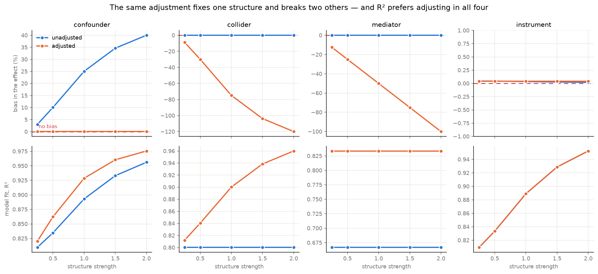
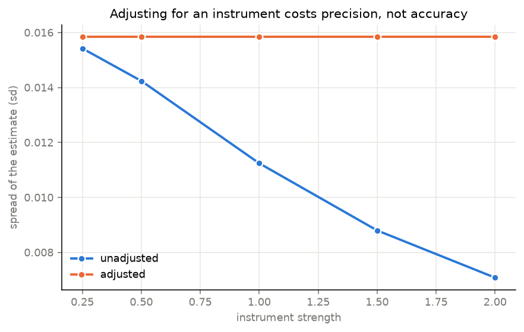

# 01 — What adjusting for the wrong variable costs

Observational data cannot tell you which variables to control for. The causal structure
has to come from outside the data — and if you get it wrong, the regression still runs,
still converges, and still prints a number.

This measures the price of getting it wrong, on data where the true effect is **planted**
and therefore exact. Four structures, all with the same true effect of 2.0:

| structure | shape | the correct move |
|---|---|---|
| confounder | `C → T`, `C → Y` | **must** adjust |
| collider | `T → K`, `Y → K` | must **not** adjust |
| mediator | `T → M → Y` | must not, if you want the total effect |
| instrument | `Z → T` | no effect on bias either way |

4,000 observations per dataset, 400 repeats per cell, OLS.

## Results, at structure strength 1.0

| structure | bias unadjusted | bias adjusted |
|---|---|---|
| confounder | **+25.05%** | +0.04% |
| collider | +0.05% | **−74.94%** |
| mediator | +0.09% | −50.01% |
| instrument | +0.04% | +0.04% |

**The same action — put the third variable in the regression — removes a 25% bias in one
structure and creates a 75% bias in another.** The two datasets are the same size, the
same shape, and both regressions fit fine.

At strength 2.0 the collider case reaches **−119.94%**: the estimated effect has the
wrong sign.

## The finding: fit quality cannot tell you which

If a practitioner cannot know the structure, the natural fallback is to let the data
choose — add the variable, see if the model improves. It always does:

| structure | R² unadjusted | R² adjusted | R² says | correct | agrees? |
|---|---|---|---|---|---|
| confounder | 0.8930 | 0.9286 | adjust | adjust | yes |
| collider | 0.8003 | 0.9002 | adjust | do not adjust | **no** |
| mediator | 0.6670 | 0.8335 | adjust | do not adjust | **no** |
| instrument | 0.8890 | 0.8890 | adjust | do not adjust | **no** |

**R² prefers adjusting in all four cases and is right in one.** That is exactly the score
a rule of "always adjust" would get, so R² carries no information about the choice at all.

Adjusting for the collider raises R² from 0.8003 to 0.9002 — a 12.5% improvement in fit —
while moving the estimate 75% away from the truth. **Better fit, worse answer**, measured
on the same data.

## The instrument: no bias, but it costs precision

| instrument strength | sd unadjusted | sd adjusted | ratio |
|---|---|---|---|
| 0.5 | 0.0142 | 0.0158 | 1.11× |
| 1.0 | 0.0112 | 0.0158 | 1.41× |
| 2.0 | 0.0071 | 0.0158 | 2.23× |

Both are unbiased, so no amount of checking the point estimate would reveal a problem.
The cost appears only in the spread: at strength 2.0 the adjusted estimator is **2.23×
noisier** for the same data. Controlling for an instrument is the textbook example of a
choice that is harmless to accuracy and expensive to confidence.

## Input / Output

Input: none — data is generated from linear structural equation models with chosen
coefficients. That is what makes the ground truth exact.
Output: `results/results.json` — 40 cells (4 structures × 5 strengths × adjusted or
not), each with bias, spread, interval coverage and R².

```
python run.py        # 16,000 fits, writes results.json
python figures.py    # two figures
pytest -q            # 9 tests
```





## Limitations

- **Linear, additive, Gaussian.** Real confounding is rarely any of those. The direction
  of each result holds generally; the magnitudes are specific to this setup.
- One confounder, one collider, one mediator. Real problems have several at once, and
  a variable can be a confounder for one pair and a collider for another.
- OLS only. Matching, inverse-probability weighting and doubly-robust estimators face
  the same structural question and would be a worthwhile second project — none of them
  escapes it, which is the point.
- The mediator result is not an error in the estimator: adjusting for a mediator gives
  the **direct** effect, which is a legitimate quantity. It is a bias only against the
  question asked here, which is the total effect.
- Interval coverage is reported but not used as a finding; in the biased cells it is
  near zero, which only restates the bias.

## Tests

`pytest -q` — 9 tests. Each asserts a direction rather than a stored number: OLS
recovering a planted coefficient, confounder bias being upward and removable, collider
bias appearing only on adjustment, the mediator reducing the estimate, the instrument
widening the spread without moving the mean, bias growing with strength, and — the
headline — R² rising when a collider is added while the estimate goes wrong. One test
guards the setup itself by checking that all four generators plant the same total effect,
so a difference between structures cannot be an artefact of a mistyped coefficient.
